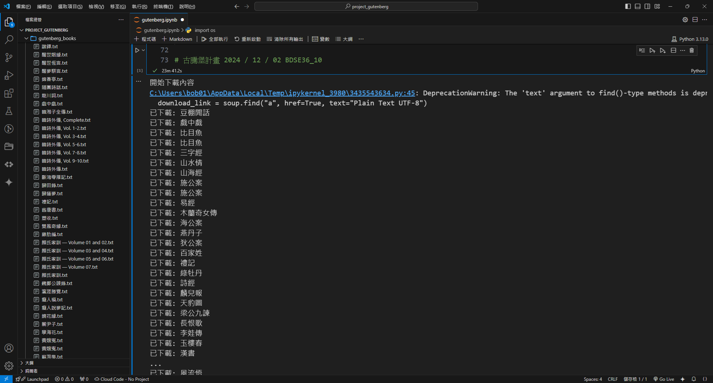

# Project_Gutenberg_OnlyChinese
網路爬蟲 - 古騰堡計畫 抓取書名含中文的書籍

# Project Gutenberg v1.0
爬取中文書籍，共 401 本。
耗時 : 約 24 分鐘
## 安裝套件
- requests 2.32.2
- beautifulsoup4 4.12.3

# Project Gutenberg v2.0
爬取中文書籍，共 478 本。
耗時 : 約 24 分鐘
- 與 v1.0 修改處 : 相同書名賦予其他數值，避免重名
## 安裝套件
- requests 2.32.2
- beautifulsoup4 4.12.3

# Project Gutenberg v2.0
爬取中文書籍，共 478 本。
耗時 : 約 4 分鐘
- 與 v2.0 修改處 : 改用 selenium 重寫相同功能
## 安裝套件
- selenium 4.27.1

## 成果

## 執行過程錄影
[執行過程錄影](https://youtu.be/ZsfGAoHg1So)

